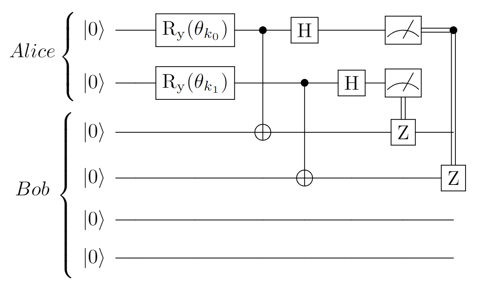

# Quantum Digital Signatures

Leander Reascos<br>
University of Minho, Master's in Engineering Physics

## Introduction

It has been demonstrated that with the existence of quantum computers large enough in terms of stable qubits, asymmetric cryptography is at great risk. This stems from the fact that, as proven by Shor, problems that are difficult for classical computers and form the basis of asymmetric cryptographic techniques become easily solvable by quantum computers using Shor's algorithm and its variants.

Thus, factorization and discrete logarithm problems can be solved in practical time by quantum computers, compromising all cryptographic techniques that rely on them. This includes digital signatures, which are based on asymmetric key algorithms like RSA.

This creates the need for new cryptographic techniques that ensure the security and properties required for asymmetric cryptography. Hence, *Post Quantum* and *Hybrid* techniques have been proposed, which were covered during the lectures. This paper focuses on a quantum technique, specifically the Quantum Digital Signature (*QDS*).

A quantum cryptographic technique, unlike *Post Quantum* and *Hybrid* techniques, requires both parties involved in communication to have access to quantum devices. Therefore, the *QDS* protocol that will be studied requires an authenticated quantum communication channel and a classical public channel.

To illustrate the basic principle of *QDS*, we will study the protocol proposed by Gottesman and Chuang in 2001 [[1]](/README.md#1-gottesman-daniel-and-chuang-isaac-quantum-digital-signatures-2001httpsarxivorgabsquant-ph0105032). During the research process, no information on experiments using this protocol with quantum computers or simulators was found, only studies using photonic laboratories [[2]](/README.md#2-roberts-gl-lucamarini-m-yuan-zl-et-al-experimental-measurement-device-independent-quantum-digital-signatures-nat-commun-8-1098-2017httpsdoiorg101038s41467-017-01245-5). Therefore, this paper also proposes a simulation of a *QDS* for a single-bit message, combining the theory studied by Gottesman and Chuang [[1]](/README.md#1-gottesman-daniel-and-chuang-isaac-quantum-digital-signatures-2001httpsarxivorgabsquant-ph0105032) with other quantum computing concepts.

## Lamport Signature

The proposed quantum digital signature protocol is based on the classical Lamport signature, where, similar to all studied asymmetric cryptography protocols, a key pair *(pk, sk)* is generated. It also requires the existence of a one-way function *f* such that *pk=f(sk)*.

Thus, the signature of the message *m* is given by the message and the private key *sk* *(m, yk=sk)*, such that the signature verification is *f(yk)=f(sk)=pk*. This implies that this key pair can only be used once, a characteristic guaranteed by the physics behind quantum communication.

The security of this signature is ensured by the one-way function, preventing an adversary from forging a key for another message.

## Gottesman and Chuang Protocol (GC-QDS)

The proposed protocol is based on the classical Lamport signature, where the one-time use of the key pair is guaranteed by the properties of quantum physics. Therefore, one-way functions are needed, and the paper discusses proposals such as *Quantum Fingerprint*, *Stabilizer states* (functions proposed for error correction), and, in the case to be discussed, quantum hashing functions using a single qubit.

Thus, the key pair consists of a randomly generated classical private key *sk* and a quantum public key *|pk>* as the result of the quantum one-way function. Due to the stochastic nature of quantum computing, validation requires multiple copies of the public keys.

According to the no-cloning theorem, the receiver cannot copy the states for verification, so it is the sender's responsibility to create multiple "copies" of the quantum states encoding the public key for different participants in the communication and the receivers.

### Quantum Hashing

The one-way function used is based on a rotation of a qubit initially in the computational basis state *|0>*. This rotation is determined by the private key, and according to Holevo’s theorem, an adversary with access to the public key cannot gain more than *n* classical bits from *n* qubits. Therefore, if the number of copies of quantum states is limited, making *n* smaller than the key size, an adversary cannot determine the private key from the public key [[3]](/README.md#3-ablayev-farid-and-vasiliev-alexander-quantum-hashing-2013httpsarxivorgabs13104922).

**|pk> = cos O |0> + sin O |1>**

**O = sk/N**, where N = 2^L, L: Private key length

### Key Generation

As discussed, for a single-bit message (the case under analysis), a set of private and public keys is needed. Thus, the private key is *SK={sk1, sk2, sk3, ...}* and the public key is *PK={|pk1>, |pk2>, |pk3>, ...}*. Since this is a quantum protocol, quantum properties are used to generate randomness from a quantum uniform superposition state.

For this study, only the sender, Alice, and the receiver, Bob, are considered. If more participants are involved, Alice must create additional copies of the quantum states so that other participants can validate her identity.

### Verification

To verify the signature of a single-bit message, Alice sends Bob the pair *(b,SKb)*, where *b:{0,1}*. Bob prepares the states corresponding to the private keys received as signatures and applies the swap test to compare the similarity between his prepared state and the state previously received as the public key from Alice. As mentioned earlier, Bob must repeat this process for the entire set of signatures (private keys) and public keys due to the probabilistic results.

The swap test yields the state *|0>* when it passes and both states are the same, and *|1>* with a non-negligible probability if they are different. If noise is present, there's a chance the swap test will fail even when the states are identical. Therefore, certain tolerance values *c1* and *c2* are introduced for quantum signature verification.

- **c1M:** Maximum acceptable number of errors for a valid signature.
- **c2M:** Maximum number of errors allowed.

Where *M* is the total number of keys in each key set. The validity of the signature is determined by counting swap test error results for a state *pki* belonging to *PK*, called *r*, as follows:

- **1-ACC:** *r<c1M*. Bob accepts the signature as valid, and at least one other person who received Alice's public keys will also accept it.
- **0-ACC:** *c1M<r<c2M*. Bob accepts the signature, but no other participants will.
- **REJ:** *r>c2M*. Bob rejects the signature.

This ensures a third party can verify Bob's result, a property known as "jury" in the literature.

### Protocol

Alice generates the key sets *{SK0, SK1}* for the bit-0 or bit-1 message and distributes the public keys to Bob. Bob stores the public keys *{PK0, PK1}* for future use, assuming the existence of a quantum memory, which is a common criticism of this technique.

Later, Alice sends Bob the message *b* and the corresponding set of private keys. Bob then applies the verification algorithm described above. The security of this protocol is again based on the limited copies of quantum states, ensuring that an adversary cannot obtain enough information about the private key from the public key.

## GC-QDS Protocol Simulation

As mentioned earlier, all randomness is generated by a quantum circuit in a uniform superposition of states. The circuit that represents this is shown below.


This random generation is encoded in the `quantum_random` function in the `libs/quantum_keyGenerator.py` file, which takes parameters for the number of bits in the result and the number of random numbers desired. The circuit is executed once for each random number.

Three objects were developed: `Alice`, `Bob`, and `QDS` (protocol), which manage the signed message and its verification. Alice signs the message, and Bob verifies it. The QDS object handles communication between them, both quantum and classical.

Alice generates a set of random numbers corresponding to the classical secret key using the previously described *quantum_random* algorithm. Similarly, Bob is initialized with system tolerances and corresponding communication channels, represented by quantum and classical registers.

To perform verification, Bob also has auxiliary registers called ancillas. Finally, QDS controls the communication flow between both parties, ensuring no one has access to the other’s relevant information unless it has been transmitted through quantum or classical communication.

### Quantum Algorithm

For the simulation of quantum communication in this case, two qubits are required for Alice, one for each quantum state corresponding to bit 0 or 1, four qubits for Bob (representing "memory" for receiving Alice's states), one to prepare the state for verification, and an auxiliary qubit for validation. Alice prepares the public keys corresponding to the private keys *ki*.

## Results

In a perfect simulation of the protocol with each component of the private key having 20 bits and a total of 30 components (resulting in a private key size of 75 bytes), the following outcomes were obtained:

```
c1M: 0 c2M:

 10
Swap Test Results for each public key

Bit0 | 0 | 0 | 0 | 0 | 0 |
Bit1 | 0 | 0 | 0 | 0 | 0 |
Errors: 0/30
```

### Discussion

These results demonstrate the theoretical behavior expected when noise and other error sources are not considered. Under such conditions, Bob can always verify Alice's identity and confirm the message's validity. Further improvements include simulating noisy conditions and performing probabilistic analysis of swap tests to assess protocol performance under less ideal circumstances.

The code for this simulation is attached.

## Conclusion

This paper has successfully illustrated a quantum digital signature protocol and implemented it in a quantum simulator. Although this implementation is simplified, it opens the door for testing quantum cryptographic techniques in real quantum environments. More advanced approaches are possible, and further work could explore variations of the protocol, especially regarding error tolerance and practical quantum memory limitations. 

## References

---
# Quantum Digital Signatures (Portugues)

Leander Reascos<br>
Universidade do Minho, Mestrado em Engenharia Fisica

## Introdução

Foi demonstrado que com a existencia de computadores quanticos o suficientemente grandes em termos de qubits estaveis a criptografia asimetrica corre um grande risco. Isto vem do facto que como foi provado por Shor, os problemas que são dificieis para computadores classicos e nos quais se baseiam as tecnicas criptograficas assimetricas passam a ser facilmente resoluveis por computadores quanticos ao fazer uso do algoritmo de Shor e as suas variantes. 

Assim os problemas de fatorização e de logaritmo discreto são resolvidos em tempo util por computadores quanticas comprometendo todas as tecnicas criptograficas que façam usso deles. Neste contexto se encaixa as assinaturas digitais que funcionam por base a algoritmos de chave assimetrica como o RSA. 

De esta forma existe a necesidade do desenvolvimento de novas tecnicas criptograficas que garantam a segurança e as diferentes propriedades que são necesarias para a criptografia assimetrica. Assim foram propostas tecnicas *Post Quantum* e *Hibridas* que foram abordadas durante as aulas. Neste trabalho será abordada a técnica quântica, mais concretamente a assinatura quântica digtal *QDS (Quantum Digital Signatures)*.

Uma técnica criptografica quantica a diferença das tecnicas *Post Quantum* e *Hibridas*, requer que ambas das partes envolvidas na comunicação tenham acceso a dispositivos quânticos, portanto para o protocolo que vai ser estudado para *QDS* é necesario da existencia de um canal de comunicação autenticado quântico e um canal publico clasico.

Com o objetivo de mostrar o principio básico da tecnica das *QDS* vai ser estudado o protocolo proposto por Gottesman e Chuang em 2001 [[1]](/README.md#1-gottesman-daniel-and-chuang-isaac-quantum-digital-signatures-2001httpsarxivorgabsquant-ph0105032). Durante o proceso de investigação não foi encontrada informação relativa a experiencias deste protocolo fazendo uso de computadores quanticos ou simuladores unicamente com auxilio de laboratorios fotonicos [[2]](/README.md#2-roberts-gl-lucamarini-m-yuan-zl-et-al-experimental-measurement-device-independent-quantum-digital-signatures-nat-commun-8-1098-2017httpsdoiorg101038s41467-017-01245-5). Por tanto neste trabalho também é proposta uma simulação de um *QDS* para uma mensagem de um unico bit na qual se junta a teoria estudada ppor Gottesman e Chuang [[1]](/README.md#1-gottesman-daniel-and-chuang-isaac-quantum-digital-signatures-2001httpsarxivorgabsquant-ph0105032) e outros conceitos de computação quântica.

## Assinatura de Lamport

O protocolo de assinatura quantica digital proposto se baseia na assinatura classica de Lamport, onde de forma semelhante a todos os protocolos de criptografia assimetrica estudados gerá um par de chaves *(pk,sk)*. Por outro lado exige a existencia de uma função de sentido único *f* tal que *pk=f(sk)*.

Assim a assinatura da mensagem *m* é dada pela mensagem e pela chave privada *sk* *(m,yk=sk)* tal que a verificação da assinatura é *f(yk)=f(sk)=pk* o que implica que este par de chaves só pode ser usada uma unica vez, carateristica que é usada e assegurada pela fisica por tras de uma comunicação quântica.

A segurança desta assinatura é garantida pela função de sentido unico, impedindo a um adversario forjar uma uma chave para uma outra mensagem. 

## Protocolo de Gottesman e Chuang (GC-QDS)

O protocolo proposto se baseia no classico de Lamport, onde o par de chaves serem de uso unico é garantido pelas propriedades da fisica quantica. De esta forma é preciso a existencia de funções de sentido unico que no artigo discutido são propostas *Quantum Findgerprint*, *Stabilizer states* (Funções propostas para correção de erros) e o caso que vai ser discutido funções de Hash quantico que usam um unico qubit.

De esta forma o par de chaves consiste numa chave privada classica *sk* gerada aleartoriamente e uma chave publica quantica *|pk>* tal que é resultado da função de sentido unico quantica. Para a verificação dada as propriedades estocasticas que tem a computação quantica é necesaria a validação com varias copias das chaves publicas.

Assim dado o teorema da não clonagem o receitor não pode copiar os estados para a sua verificação, por tanto é trabalho do emisor criar diferentes "copias" dos estados quanticos que codificam a chave publica tanto para os diferentes elementos dentro da comunicação como para os receitores.

### Quantum Hashing

A função de sentido unico usada se baseia numa rotação a um qubit inicialmente no estado *|0>* dabase computacional. Tal que esta rotação é dada pela chave privada e pelo teorema de Holevo um adversario que tenha acceso a chave publica não pode ter acceso a mais do que *n* bits classicos a partir de *n* qubits assim se o numero de copias dos estados quanticos for limitado sendo *n* menor que o tamnanho das chaves um adversario não lhe é possivel conhecer a chave privada a partir da chave publica [[3]](/README.md#3-ablayev-farid-and-vasiliev-alexander-quantum-hashing-2013httpsarxivorgabs13104922).

**|pk> = cos O |o> + sin O |1>**

**O = sk/N**, N: 2^L, L: Tamanho da chave privada

### Geração de Chaves

Com o explicado anteriormente é necesario que para uma unica mensagem, de um unico bit que é o caso em analise, exista um conjunto de chaves privadas e chaves publicas. Assim a chave privada é *SK={sk1, sk2, sk3, ...}* e a chave publica *PK={|pk1>, |pk2>, |pk3>, ...}*. Para este trabalho como se esta a explorar um protocolo quantico aproveitou-se das propriedades quanticas para que a geração de qualquer aleartoriedade seja produto de um estado em superposição uniforme quantico.

Para este caso de estudo só se tem em conta os participantes emisor, Alice e receitor, Bob, se existirem mais intervinientes na comunicação o numero de chaves a ser copiado por Alice incialmente aumenta, dada a necesidade de os outros participantes puderem validar a identidade de Alice e que esta esteja a ser honesta de forma a que as chaves publicas que recebem ambas das partes sejam iguais.

### Verificação

Para verificar a assinatura de uma mensagem de um unico bit a Alice tem de enviar ao Bob o par *(b,SKb)*, *b:{0,1}* e o Bob vai preparar os estados correspondetes as chaves privadas recebidas como assinaturas, consequentemente aplica o swap test para comparar a semelhança do seu estado preparado com o estado anteriormente recebido como chave publica por parte da Alice. Como foi referido dados os resultados probabilisticos o Bob precisa fazer isto para todo o conjunto de assinaturas (chaves privadas) e chaves publicas.

Os resultados do Swap test vão ser o estado *|0>* quando passa o test e ambos estados são iguais, e *|1>* com uma probabilidade não neglincenciavel se forem diferentes. No caso de se tratar de um dispositivo com ruido existe uma probabilidade extra de mesmo quando os estados serem iguais o swap test falahar. Por tanto para a verificação da assinatura quantica se introduzem certos valores de tolerancia para erros *c1* e *c2*.

- **c1*M:** Numero maximo de erros aceitaveis tal que a assinatura é valida.
- **c2*M:** Numero maximo de erros permitidos

Onde *M* é o numero total de chaves que contem cada grupo de chaves, desta forma a validez da assinatura parte da contagem de resultados de erros ao swap test para um dos estados *pki* que pertence a *PK* chamado de *r*, assim

- **1-ACC:** *r<c1M*. Quer dizer que o Bob aceita a assinatura como valida e que pelo menos mais uma pessoa a quem foi trasmitidas as chaves publicas de Alice vai aceitar a assinatura.
- **0-ACC:** *c1M<r<c2M*. O Bob aceita a assinatura mas mais nenhuma pessoa participante ira a aceitar a mesma como valida
- **REJ:** *r>c2M*. O Bob rejeita a assinatura

Estas respostas se devem ao facto de haver uma propriedade que precisam garantir as assinaturas e é que uma terceira parte possa validar o resultado que o Bob obteve denominado como um juri na literatura.

### Protocolo

Alice gera o conjunto de chaves *{SK0,SK1}* para a mensagem com o bit a 0 ou 1, e distribui as chaves publicas ao Bob, que no artigo é descrito como um procedimento que precisa o uso de acordo de chaves quantico *(QKD)*, isto no presente analise não foi tido em conta dado que se presupõe a existencia de um canal quantico seguro. Assim Bob recebe as chaves publicas *{PK0, PK1}* e as armazena até ser necesario a sua utilização, pelo que presupõe da existencia de uma memoria quantica sendo uma critica recorrente a esta tecnica. 

Posteriormente quando a Alice envia ao Bob a mensagem *b* e o seu correspondente conjunto de chaves privadas. Posteriormente o Bob aplica o algoritmo de verificação anteriormente descrito. Há que notar que a segurança de este protocolo se baseia novamente na existencia limitada de copias dos estados quanticos tal que um adversario nãp pode obter suficiente informação sobre a chave privada a partir da publica.

## Simulação do protocolo GC-QDS

Como referido anteriormente, toda escolha aleartoria é feita a partir de um circuito quantico em superposição uniforme de estados, assim o circuito que o representa é o seguinte


Esta geração aleartoria se encontra codificada na função `quantum_random` no ficheiro `libs/quantum_keyGenerator.py` cujos parametros são o numero de bits que vai ter o resultado e o numero de numeros aleartorios que se pretende como resultado. Finalmente o circuito é executado uma vez para cada numero aleartorio pretendido.

Foi desenvolvidos tres objetos, `Alice`, `Bob` e `QDS` (protocolo) que vão itnervir na mensagem assinada e na verificação da mesma, mantendo a notação, Alice envia a mensagem assinada e Bob verifica. O objeto QDS para esta caso cumpre o papel de meio de comunicação tanto quantico como classico.

Há que ter em atenção que a construção deste protocolo em termos de programação podia ser muito mais simplificada, não entanto foi decidido ter este nivel de abstração de forma a recriar de melhor maneira uma situação "real".

Assim, a Alice gera de forma aleartoria o conjunto de numeros aleartorios que correspondem a chave secreta classica usando o algoritmo *quantum_random* anteriormente descrito. Da mesma forma o Bob é inicializado com as tolerancias que tem de suportar o sistema e os canais de comunicação correspondentes, sendo estes representados por registos quanticos e classicos.

Para o procedimento de verificação o Bob conta tambem com registos auxiliares denominados por ancillas. Finalmente o QDS controla o fluxo de comunicação entre ambos elementos em que nenhum deles tem acceso a informação relevante do outro a não ser que tenha existido uma comunicação quantica ou classica na que esta informação foi enviada. 

Como foir eferido anteriormente é um conjunto de chaves que conformam a chave global usada que é enviada da Alice para o Bob e numa situação "real" teria de serem enviadas todas a vez implicando para o presente caso um maior numero de qubits a serem usados, por tanto foi simplificado de forma a que em termos do algoritmo é enviado e verificada um par de chavez de cada vez mas a mensagem não muda.

### Algoritmo Quantico

A simualação da comunicação quantica precisa para o caso em estudo dois qubits para a Alice, um para cada estado quantico correspondente ao bit seja 0 ou 1, 4 qubits para o Bob que representam "a memoria" para receber os estados da Alice, 1 para preaprar o estado a verificar e um qubit auxiliar para realizar a validação. Assim o algoritmo quantico é o seguinte, a Alice preapra as chaves publicas correspondentes as chaves privadas *ki*


Posteriormente, a Alice envia os estados que codificam as chaves publicas por um canal de comunicação quantico autenticado entre ela e o Bob, para isto é usada a teleportação intracircuito para o qual dada a medição dos qubits da Alice é necesario aplicar uma correção aos qubits do bob, para o qual é usado um canal de comunicação classico, nesta parte sem aprofundar na teoria se esta a desenvolver uma tecnica simples de QKD.



Finalmente a Alice envia por um canal de comunicação classico a mensagem e a assinatura e dependendu de qual foi a mensagem Bob prepara e realiza o swap test para os estados correspondentes, assim para o caso que recebeu a mensagem com *b=0* temos o seguinte circuito final


## Resultados

Para uma simulação deste protoclo em que cada componente da chave privada tem 20 bits e no total são 30 componentes, da um total de uma chave privada de tamanho de 75 bytes. Em condições perfeitas se obteve:

```
c1M: 0 c2M: 5.699999637603758
0.0 1-ACC
```

Usando um simulador com ruido disponibilizado pela Qiskit

```
c1M: 1.5 c2M: 5.699999637603758
8.0 REJ
```

```
c1M: 1.5 c2M: 5.699999637603758
4.0 0-ACC
```


## References

### [[1] Gottesman, Daniel and Chuang, Isaac. Quantum Digital Signatures. (2001).](https://arxiv.org/abs/quant-ph/0105032) 
### [[2] Roberts, G.L., Lucamarini, M., Yuan, Z.L. et al. Experimental measurement-device-independent quantum digital signatures. Nat Commun 8, 1098 (2017).](https://doi.org/10.1038/s41467-017-01245-5)

### [[3] Ablayev, Farid and Vasiliev, Alexander. Quantum Hashing. (2013)](https://arxiv.org/abs/1310.4922)
